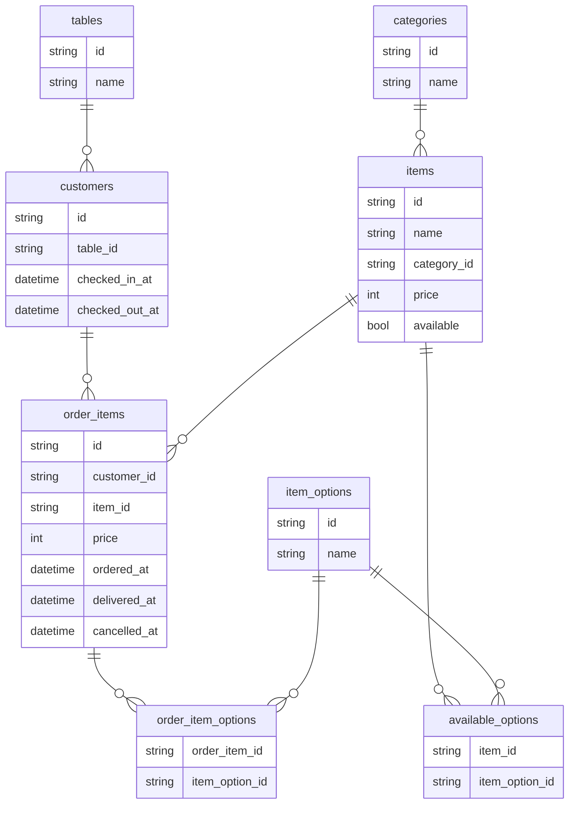

# 寿司オーダーシステム

ゆめみサーバーサイドインターンシップ2023の課題

## Requirements

- Go 1.18以上(for sql-migrate)
- Docker

## SetUp

1: envファイルを作成する

```bash
cp .env.example .env
```

2: DBを起動する

```bash
make up
```

3: DBにテーブルを作成する

```bash
make migrate-up
```

4: アプリケーションサーバーを起動する

5: OpenAPIを確認する

http://localhost:8080/swagger-ui/index.html

## テーブルの追加・変更

1: Migration Fileを作成する

```bash
make create-migration name={migration_name}
```

2: 生成されたMigration Fileを編集する

3: Run Migration

```bash
make migrate-up
```

## ER図


